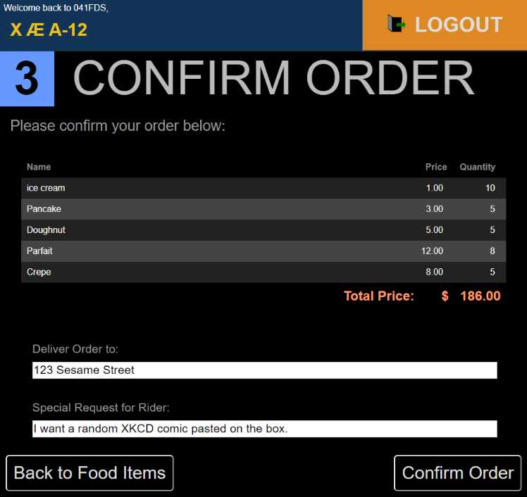

# fds
Food Delivery Service Application Backend for CS2102 Project.

Built in Node.js using Express JS framework.

## Installation

### Requirements

- Node.js v12.13.1
- `.env` file with your personalized configuration listed below.

### Install

1. Clone this repository.
2. Install the dependencies by doing `npm i` in the root folder.

## Usage

Enter `npm start` to launch the server.

### Configuration

| Name | Example | Description |
| ---- | ------- | ----------- |
| PORT | 4000    | The port which you want this backend server to run in. |
| PGHOST | localhost | The IP that the postgres server is on.  |
| PGUSER | postgres | The username used to log in to the postgres database. |
| PGPASSWORD | password | The password used to log in to the postgres database. |
